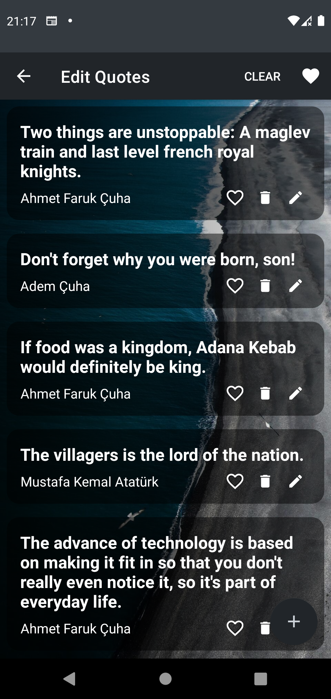

# LegendaryQuotes
### LegendaryQuotes is an android application that allows you to save your favorite quotes. You can edit, delete or add to favorite your quotes. Also wonderful images that you can change with one button are located in background of quotes.

  

## Libraries
- <a href="https://developer.android.com/training/data-storage/room">Room</a> -> to save users favorite movies to local database.
- <a href="https://developer.android.com/topic/libraries/architecture/datastore">Room</a> -> to save users preferences.
- <a href="https://developer.android.com/topic/libraries/architecture/viewmodel">ViewModel</a> -> to hold live-data and flow datas.
- <a href="https://developer.android.com/topic/libraries/architecture/livedata">LiveData</a> -> to hold observable data.
- <a href="https://developer.android.com/kotlin/flow">Flow</a> -> to receive live updates from local and remote.
- <a href="https://developer.android.com/kotlin/coroutines">Coroitunes</a> -> to load datas asynchronously.
- <a href="https://developer.android.com/training/dependency-injection/hilt-android">Dagger-Hilt</a> -> to integrate dependency injection.
- <a href="https://developer.android.com/topic/libraries/view-binding">ViewBinding</a> -> to access and bind xml views.
- <a href="https://developer.android.com/guide/navigation">Navigation</a> -> to pass between fragments.
- <a href="https://github.com/airbnb/lottie-android">Lottie</a> -> to load animations to get better ui.

## Screenshots
 

<pre><code>Copyright 2021 Ahmet Faruk Çuha</code></pre>
